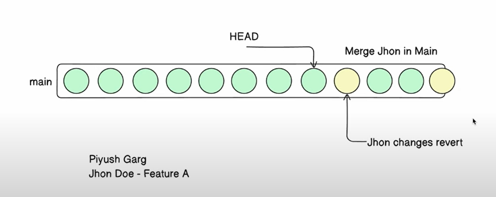

# Git Commands  
### By M. Huzaifa Abdulahad

---

## 🚀 **Initialize Git**
To initialize a new Git repository in your project directory, use the following command:
```bash
git init
```

## 🌳 Git Flow
```bash
 Working Directory
         |
    Staging Area
         |
    Local Repository
         |
    Remote Repository
```


## 🔍 Check What is Being Changed
To see what has been changed, use

```bash
 git diff <file_name>
 git diff
```
### Output Explanation:
* ++ : Addition in the file.
* -- : Deletion from the file.


## ➕ Adding Files to Version Control
```bash
 # To add specific files:
 git add <file_name>

 # To add all files from the current directory:
 git add . 
```

## ❌ Remove Files from Staging Area
```bash
 # To remove a file:
 git rm <path || file_name>

 # To force remove:
 git rm -f <path || file_name>

 # To reset to a specific commit:
 git reset --hard <commit_hash>
 
 # To revert a commit (without losing history):
 git revert <commit_hash>
```

## 📅 Introduction to Commit
Regularly committing your code creates checkpoints throughout your project. For instance, if you're building a game, after completing level-1, you commit your changes. Once level-2 and level-3 are done, you commit again. If an issue arises at level-3, you can easily revert to the version from level-2 by checking out the commit made at that stage. These timely commits help you track your progress and allow you to roll back to a stable version whenever needed.

```bash
 # To commit changes:
 git add .
 git commit -m "User friendly message."
```

### 📜 View Commit History
To see who committed, when they committed, and what they changed:

```bash
 git log
 git log --oneline
 git log <banch_name>

 # To view the details of a specific commit:
 git show <commit_hash>

 # If you want to revert to a specific commit:
 git reset --hard <commit_hash>

# To revert a specific commit (while keeping the commit history intact):
git revert <commit_hash> 

```


```bash
git log
```

#### Example Output
```bash
commit bf3be7266fd9bf67392c3f24b7c8424adc109e6e (HEAD -> master)
Author: = <=>
Date:   Tue Jan 28 21:38:20 2025 +0500

    Add initial code.
```


```bash
# For short log's
git log --oneline
```

#### Example Output:
```bash
bf3be72 (HEAD -> master) Add initial code.
```

* Every commit has unique ID, Author name, & message.


### 🖋️ See Line-by-Line Changes (Blame)
```bash
git show 
```

#### Example Output:
```bash
C:\Practice\Git\Play with git> git show 961a339
commit 961a339e951b73d77e709af9615b7735cb58c3eb (HEAD -> master)
Author: = <=>
Date:   Tue Jan 28 21:46:01 2025 +0500

    Add isAbove18 functionality in index.

diff --git a/index.js b/index.js
index fa0cc57..fa77fb0 100644
--- a/index.js
+++ b/index.js
@@ -1,6 +1,11 @@
 let description = "This is git dummy crash course";
 let name = "M Huzaifa Abdulahad";
 let dob = "30-07-2007";
+
 function sayHi() {
   console.log("Hi Mr, ", name);
 }
+
+function isAbove18() {
+  return true;
+}
```

### To see line by line change did why which author & time
```bash
git blame <file_name>
```


#### Example Output
```bash
C:\Practice\Git\Play with git> git blame index.js
^bf3be72 (= 2025-01-28 21:38:20 +0500  1) let description = "This is git dummy crash course";
^bf3be72 (= 2025-01-28 21:38:20 +0500  2) let name = "M Huzaifa Abdulahad";
^bf3be72 (= 2025-01-28 21:38:20 +0500  3) let dob = "30-07-2007";
961a339e (= 2025-01-28 21:46:01 +0500  4) 
^bf3be72 (= 2025-01-28 21:38:20 +0500  5) function sayHi() {
^bf3be72 (= 2025-01-28 21:38:20 +0500  6)   console.log("Hi Mr, ", name);
^bf3be72 (= 2025-01-28 21:38:20 +0500  7) }
961a339e (= 2025-01-28 21:46:01 +0500  8) 
961a339e (= 2025-01-28 21:46:01 +0500  9) function isAbove18() {
961a339e (= 2025-01-28 21:46:01 +0500 10)   return true;
961a339e (= 2025-01-28 21:46:01 +0500 11) }
```


# Github 
GitHub is a remote server used to host your code.


## 🌐 Setting Up GitHub
Your GitHub repository remote address might look like this: https://github.com/M-Huzaifa00/_learn_git.git.

### 🛠️ How to Set Up Git with Remote
```bash
 # To add a remote repository:
 git add remote remote_name remove_uri_address

# To check if the remote repository is correctly set up:
git remote -v
```


### 🚀 Push Code to Remote
```bash
 # To push your code to the remote repository:
 git push -u origin main
 git push origin main
```

## 🌱 Branching
One of the best practices for maintaining a clean main branch is to create a separate feature branch for each new task or feature you're working on. By doing this, you can isolate all your development work, including any experimentation or "dirty work," from the main codebase.

### 🌿 Sample Branching Image 🌳


**This approach offers several key benefits**

* Isolated Development: You can freely work on a feature or bug fix without worrying about affecting the main branch. If something goes wrong or if you decide to abandon the work, you can do so without any repercussions on the main codebase.

* Cleaner Git History: By creating a feature branch, you can work on as many commits as needed to get your feature or fix right. Once the work is complete and ready for review, you can squash all the commits into a single, concise commit before merging it into the main branch. This ensures the main branch history remains neat and understandable.

* Easy Reversion: If, after merging, the feature doesn't work as expected or introduces unwanted changes, you can revert the single commit that was merged from the feature branch. This is far more efficient than having to go through multiple commits, especially when those commits involve experimental or incomplete work.

* Collaboration & Flexibility: If you're working in a team, this branching strategy allows others to easily review your work before it gets merged into the main branch. It also provides flexibility if another team member needs to quickly fix a bug or push a small change to the main branch without waiting for the feature work to be complete.


### 🛠️ In Practice
* When you're starting work on a new feature or bug fix, create a dedicated branch (e.g., feature/my-new-feature).
Work on the branch with as many commits as necessary to implement the feature or fix.
Once done, and after testing, squash all commits into a single commit to keep the main branch history clean.
Merge the feature branch into the main branch.
If things go wrong, revert the single merge commit rather than handling multiple individual commits.


## 🌿 **Check Your Current Branch** 🌿
To find out which branch you are currently working on, run the following command:
```bash
git branch
```


### 📜 Output Example:
```branch
 # (*) represent current branch
 * main
  feature/new-feature
  bugfix/fix-issue
```

## 🌱 **Create a New Branch** 🌱

To create a new branch, use the following command:

```bash
git branch huzaifa-feat
```

### 📝 Explanation:
* huzaifa-feat is the name of the new branch you want to create.
* This command creates the branch but does not switch to it.

### 🔄 To Switch to the New Branch:
After creating the branch, you can switch to it using:

```bash
 git checkout huzaifa-feat

 # Alternatively, you can combine both creating and switching to the branch with this command:
 git checkout -b huzaifa-feat
```
Now you’re on the huzaifa-feat branch and ready to start working! 💻🚀


